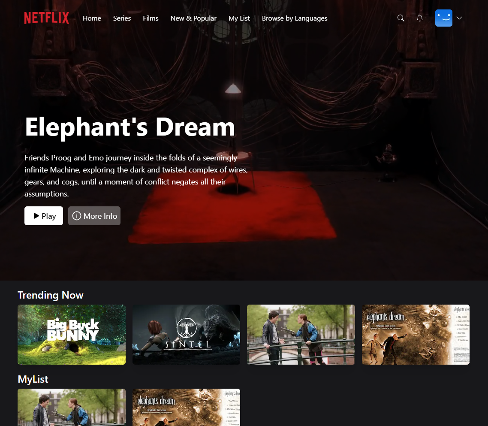

# Netflix Clone ⚛️



The application is based Code With Antonio tutorial [here](https://www.youtube.com/watch?v=mqUN4N2q4qY). This application includes the usage of Next Auth library with credentials, Github and Google providers to address the authentication. For the data layer it uses the MongoDB as database and Prisma as ORM. 

Decided to add the following tweaks to the application:

* Used the NextJS App router with RSCs;
* Used experimental server actions;
* Used the Next Auth middleware instead of manually deal with unauthenticated users;
* Added minor improves to the mobile design;
* Used React Hook Form to manage the Sign In and Sign Up forms (with zod validation);
* Used Link and Image NextJS components;

#### Get Started

To set up the app execute the following commands.

```bash
git clone https://github.com/hlopes/netflix-clone.git
cd easy-money
cp .env.example .env
pnpm install
```

##### `pnpm start`

Runs the app in the development mode.\
Open [http://localhost:3000](http://localhost:3000) to view it in the browser.

This project uses [`next/font`](https://nextjs.org/docs/basic-features/font-optimization) to automatically optimize and load Inter, a custom Google Font.

##### `pnpm build`

Builds the app for production to the `build` folder.\
It correctly bundles NextJS in production mode and optimizes the build for the best performance.

The build is minified and the filenames include the hashes.\
Your app is ready to be deployed!

See the section about [deployment](./deployment.md)